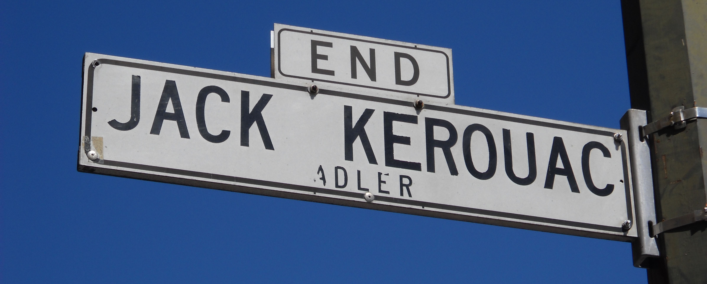

# Street Names

## Definition

* The official name assigned to a segment of street or right-of-way that is legislated through the subdivision process and/or Board of Supervisors
  * Street names are generally established when streets are created as a result of the development / subdivision of land [codified in the City's subdivision codes](http://library.amlegal.com/nxt/gateway.dll/California/subdivision/subdivisioncode?f=templates$fn=default.htm$3.0$vid=amlegal:sanfrancisco_ca$anc=JD_Subdivision)
  * Renaming streets can be initiated by members of the public or the Board of Supervisors [according to the process documented by Public Works](http://sfpublicworks.org/services/establishing-street-names)

> **Note:** The above only applies to city-owned public streets

### Illustration

* Above is the street sign for Jack Kerouac Alley \(formerly Adler Alley\). On the street sign, both names are present for five years following a name change.

### Authority

* New street names assigned during the development / subdivision of land
  * Recordation of final parcel maps including new streets happens with the Office of the Assessor-Recorder 
  * Before recordation, subdivision maps are approved by the County Surveyor, the Public Works Director and the Board of Supervisors
  * Part of the process defined [in the City Subdivision Codes](street-names.md)
* [Renaming of streets requires](http://sfpublicworks.org/services/establishing-street-names):
  * Petition with signatures submitted to Public Works for review with a submittal fee
  * The resolution referred to the Clerk of the Board of Supervisors 
  * A Public Hearing at the Land Use and Economic Development Committee
  * Board of Supervisors approval
  * Mayor's signature                             

## Use

* For official base maps to label the streets properly
* As a component part of a full address \([see address formatting guidance](../../data-structure-and-formats/formats/location-addresses.md)\)
* To validate against user submitted address data \(e.g. in a form online\)

### Accepted values

* Official street names are maintained in the City's Official Basemap updated by Public Works staff
* The full list of valid City street names is [available in the street names dataset](https://data.sfgov.org/Geographic-Locations-and-Boundaries/Street-Names/6d9h-4u5v)

### Reference Datasets

| Dataset | Description and Constraints | Reference Columns |
| :--- | :--- | :--- |
| [Street Names](https://data.sfgov.org/Geographic-Locations-and-Boundaries/Street-Names/6d9h-4u5v) | Contains a list of officially valid street names contained in the City's Basemap | `fullstreetname` composed of `streetname` & `streettype` & `postdirection` |
| [San Francisco Basemap Street Centerlines](https://data.sfgov.org/Geographic-Locations-and-Boundaries/San-Francisco-Basemap-Street-Centerlines/7hfy-8sz8) | A geographic reference of the all basemap streets including a number of street components like the valid name | `streetname` composed of `street` & `st_type` |

### Is anything wrong, unclear, missing?

[Leave a comment.](https://github.com/DataSF/draft-publishing-standards/issues/new?title=Comment:Street-Names&body=Comment:Street-Names)

