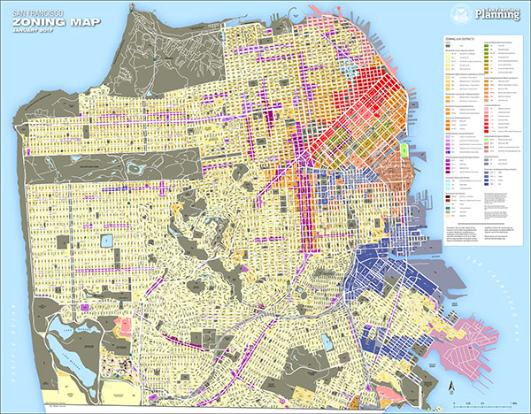

# Zoning Use Districts

## Definition

* Zoning regulations govern how land can be used in various geographic areas called "zoning use districts" \(also known as "zoning," "zones" or "use districts"\).
* Zoning regulations may:
  * govern sizes and shapes of buildings
  * limit the number of units or apartments that can exists on a property
  * require the accommodation of car parking off of the street
  * set controls on planting street trees under certain circumstances
  * specify how late a business can remain open at night

### Illustration

* Each part of the City is divided into zones that correspond to regulations in the Planning Code
* Get a higher resolution PDF version of the [map above provided by Planning](http://default.sfplanning.org/zoning/zoning_map.pdf)

### Authority

* Zoning regulations are set out in the [San Francisco Planning Code](http://planningcode.sfplanning.org) and modified through legislation
* The [Planning Department](http://sf-planning.org/) enforces zoning compliance

## Use

* For understanding what is permitted, conditional and not permitted when building in San Francisco

### Reference

| Reference | Description and Constraints | Reference Columns |
| :--- | :--- | :--- |
| [Zoning Districts](https://data.sfgov.org/Geographic-Locations-and-Boundaries/Zoning-Districts/8br2-hhp3) | The Zoning Districts are a component of the Zoning Map which in turn is a key component of the San Francisco Planning Code. | `url` links to the district definition in the planning codes   `zoning` is the district code |
| [Planning Code](http://planningcode.sfplanning.org) | The official Zoning Map can be found in the San Francisco Planning Code on the links under ZONING MAPS on the left navigation column\). | N/A |

